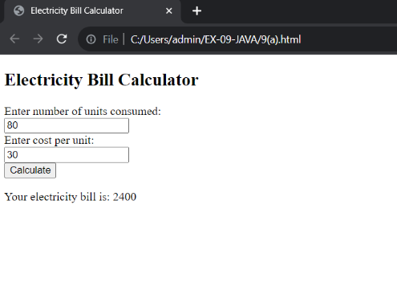
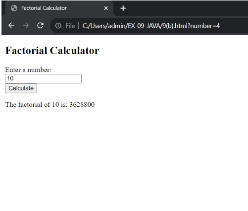
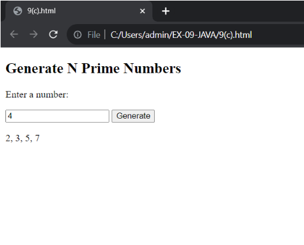
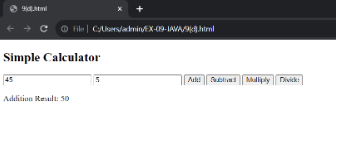
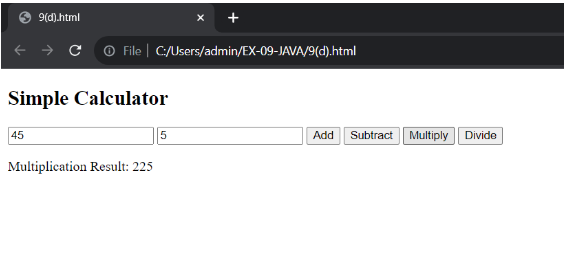
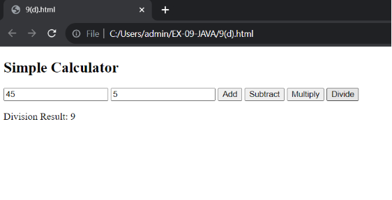
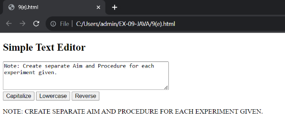
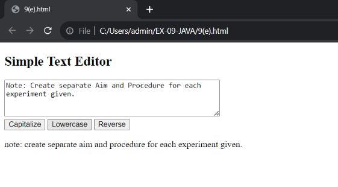
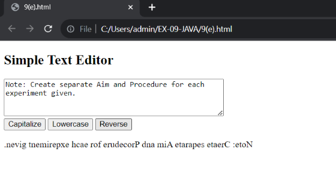
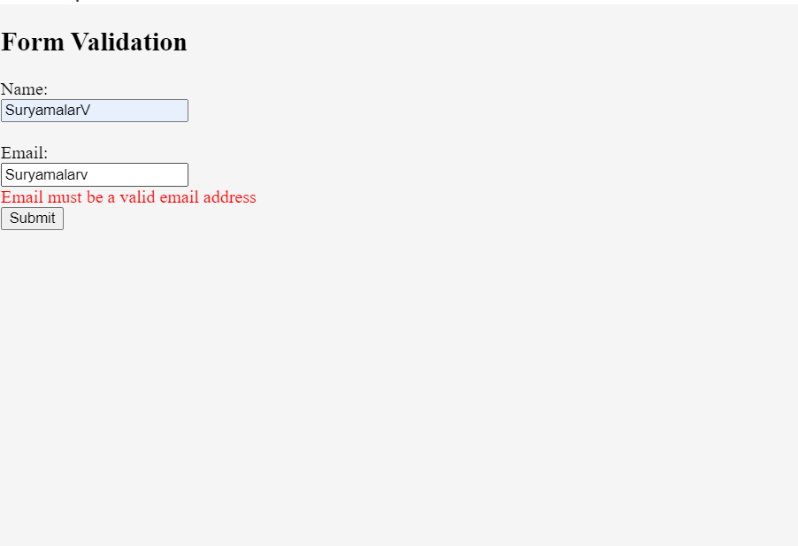

# ODD23-24-WT-JavaScript
# Ex-09 JavaScript
# Ex-09(a)
# AIM
Create a form with java script code to calculate electricity bill.

# DESIGN STEPS: 9(a)
# Step 1:
Input Units Consumed: Prompt the user to enter the number of units consumed. This can be done using a Scanner object in Java.

# Step 2:
Set Rate Per Unit: Define a variable for the rate per unit of electricity. This will be a constant value that you can set according to the electricity rates in your area.

# Step 3:
Calculate Bill: Multiply the number of units consumed by the rate per unit to calculate the total bill.

# Step 4:
Display Bill: Print the calculated bill to the console.

# CODE: 9(a)
```
<!DOCTYPE html>
<html>
<head>
    <title>Electricity Bill Calculator</title>
</head>
<body>
    <h2>Electricity Bill Calculator</h2>
    <form id="billForm">
        <label for="units">Enter number of units consumed:</label><br>
        <input type="number" id="units" name="units"><br>
        <label for="cost">Enter cost per unit:</label><br>
        <input type="number" id="cost" name="cost"><br>
        <input type="button" value="Calculate" onclick="calculateBill()">
    </form>
    <p id="result"></p>

    <script>
        function calculateBill() {
            var units = document.getElementById('units').value;
            var cost = document.getElementById('cost').value;
            var bill = units * cost;
            document.getElementById('result').innerHTML = 'Your electricity bill is: ' + bill;
        }
    </script>
</body>
</html>
```

# OUTPUT:9(a):


# Ex-09(b)
# AIM
Develop a JavaScript program to compute the factorial of a given number without recursion.

# DESIGN STEPS: 9(b)
# Step 1:
Initialize a variable result to 1. This will hold the final factorial value.

# Step 2:
Start a loop from 2 to the given number n.

# Step 3:
In each iteration of the loop, multiply the current number i with result and update result.

# Step 4:
After the loop ends, result will hold the factorial of n. Return result.

# CODE: 9(b)
```
<!DOCTYPE html>
<html>
<head>
    <title>Factorial Calculator</title>
</head>
<body>
    <h2>Factorial Calculator</h2>
    <form id="factorialForm">
        <label for="number">Enter a number:</label><br>
        <input type="number" id="number" name="number"><br>
        <input type="button" value="Calculate" onclick="calculateFactorial()">
    </form>
    <p id="result"></p>

    <script>
        function calculateFactorial() {
            var num = document.getElementById('number').value;
            var factorial = 1;
            for (var i = 1; i <= num; i++) {
                factorial *= i;
            }
            document.getElementById('result').innerHTML = 'The factorial of ' + num + ' is: ' + factorial;
        }
    </script>
</body>
</html>
```

# OUTPUT:9(b):


# Ex-09(c)
# AIM
Construct a JavaScript code to generate ‘N’ prime numbers.

# DESIGN STEPS: 9(c)
# Step 1:
Initialize a count variable to keep track of the number of prime numbers generated.

# Step 2:
Start from the number 2 (the first prime number), and for each number, check if it is prime.

# Step 3:
If the number is prime, increment the count and print the number.

# Step 4:
Repeat steps 2 and 3 until ‘N’ prime numbers have been generated.

# CODE: 9(c)
```
<!DOCTYPE html>
<html>
<body>

<h2>Generate N Prime Numbers</h2>

<p>Enter a number:</p>
<input id="num" type="number">
<button onclick="generatePrimes()">Generate</button>

<p id="primes"></p>

<script>
function generatePrimes() {
    var n = document.getElementById("num").value;
    var primes = [];
    for(var i = 2; primes.length < n; i++) {
        if(isPrime(i)) {
            primes.push(i);
        }
    }
    document.getElementById("primes").innerHTML = primes.join(", ");
}

function isPrime(num) {
    for(var i = 2, sqrt = Math.sqrt(num); i <= sqrt; i++)
        if(num % i === 0) return false; 
    return num > 1;
}
</script>

</body>
</html>
```

# OUTPUT:9(c):


# Ex-09(d)
# AIM
Construct a JavaScript program to implement a simple calculator.

# DESIGN STEPS: 9(d)
# Step 1:
Define a function for each operation (addition, subtraction, multiplication, division) that takes two numbers as input and returns the result of the operation.

# Step 2:
Define a function calculate that takes three parameters: two numbers and an operator. This function will call the appropriate operation function based on the operator provided.

# Step 3:
Call the calculate function with the numbers and operator as arguments to perform a calculation.

# Step 4:
Print the result of the calculation.

# CODE: 9(d)
```
<!DOCTYPE html>
<html>
<body>

<h2>Simple Calculator</h2>

<input id="num1" type="number" placeholder="Number 1">
<input id="num2" type="number" placeholder="Number 2">

<button onclick="add()">Add</button>
<button onclick="subtract()">Subtract</button>
<button onclick="multiply()">Multiply</button>
<button onclick="divide()">Divide</button>

<p id="result"></p>

<script>
function add() {
    var num1 = document.getElementById("num1").value;
    var num2 = document.getElementById("num2").value;
    var result = Number(num1) + Number(num2);
    document.getElementById("result").innerHTML = "Addition Result: " + result;
}

function subtract() {
    var num1 = document.getElementById("num1").value;
    var num2 = document.getElementById("num2").value;
    var result = num1 - num2;
    document.getElementById("result").innerHTML = "Subtraction Result: " + result;
}

function multiply() {
    var num1 = document.getElementById("num1").value;
    var num2 = document.getElementById("num2").value;
    var result = num1 * num2;
    document.getElementById("result").innerHTML = "Multiplication Result: " + result;
}

function divide() {
    var num1 = document.getElementById("num1").value;
    var num2 = document.getElementById("num2").value;
    if (num2 != 0) {
        var result = num1 / num2;
        document.getElementById("result").innerHTML = "Division Result: " + result;
    } else {
        document.getElementById("result").innerHTML = "Cannot divide by zero";
    }
}
</script>

</body>
</html>
```

# OUTPUT:9(d):





# Ex-09(e)
# AIM
Design a simple text editor JavaScript application where we can manipulate the user input in different styles, edit the input, capitalize, and many string operations.

# DESIGN STEPS: 9(e)
# Step 1:
User enters the text in the text area.

# Step 2:
User clicks on one of the buttons to perform an operation (capitalize, lowercase, reverse).

# Step 3:
The JavaScript function corresponding to the operation is executed. This function gets the text from the text area, performs the operation, and updates the result paragraph with the new text.

# Step 4:
The result is displayed on the webpage. The user can perform more operations or enter new text. The process repeats from Step 2.

# CODE: 9(e)
```
<!DOCTYPE html>
<html>
<body>

<h2>Simple Text Editor</h2>

<textarea id="text" rows="4" cols="50"></textarea><br>
<button onclick="capitalize()">Capitalize</button>
<button onclick="lowercase()">Lowercase</button>
<button onclick="reverse()">Reverse</button>

<p id="result"></p>

<script>
function capitalize() {
    var text = document.getElementById("text").value;
    document.getElementById("result").innerHTML = text.toUpperCase();
}

function lowercase() {
    var text = document.getElementById("text").value;
    document.getElementById("result").innerHTML = text.toLowerCase();
}

function reverse() {
    var text = document.getElementById("text").value;
    document.getElementById("result").innerHTML = text.split("").reverse().join("");
}
</script>

</body>
</html>
```

# OUTPUT:9(e):




# Ex-09(f)
# AIM
Design a JavaScript program which displays error messages when a field in form is entered incorrectly.

# DESIGN STEPS: 9(f)
# Step 1:
User fills out the form and clicks the “Submit” button.

# Step 2:
The validateForm function is executed. This function gets the values of the name and email fields.

# Step 3:
The function checks if the name and email fields are filled out and if the email is a valid email address. If a field is entered incorrectly, it sets the corresponding error message.

# Step 4:
The function updates the corresponding error message spans with the error messages. If a field is entered incorrectly, the error message is displayed on the webpage. The user can correct the errors and submit the form again. The process repeats from Step 2.

# CODE: 9(f)
```
<!DOCTYPE html>
<html>
<body>

<h2>Form Validation</h2>

<form id="myForm">
  <label for="name">Name:</label><br>
  <input type="text" id="name" name="name"><br>
  <span id="nameError" style="color:red"></span><br>
  <label for="email">Email:</label><br>
  <input type="text" id="email" name="email"><br>
  <span id="emailError" style="color:red"></span><br>
  <input type="button" value="Submit" onclick="validateForm()">
</form>

<script>
function validateForm() {
    var name = document.getElementById("name").value;
    var email = document.getElementById("email").value;
    var nameError = "";
    var emailError = "";

    if (name == "") {
        nameError = "Name must be filled out";
    }

    if (email == "") {
        emailError = "Email must be filled out";
    } else if (!email.includes("@")) {
        emailError = "Email must be a valid email address";
    }

    document.getElementById("nameError").innerHTML = nameError;
    document.getElementById("emailError").innerHTML = emailError;
}
</script>

</body>
</html>
```


# OUTPUT:9(f):



RESULT:
All java codes excecuted successfully.
